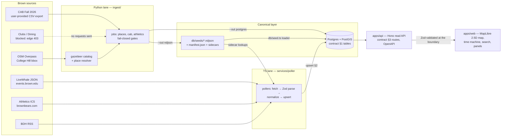

# BrownSync architecture

How data moves from Brown's servers to pixels, and the rules that keep two
independently-built halves of the system honest with each other. The shapes referenced
throughout (§1 schema, §2 upsert semantics, §3 API, §4 taxonomy, §5 endpoints, §6 seeds)
are sections of `DATA_CONTRACT.md` — the single integration point between all lanes.

## 1. Data flow: ingestion → canonical → API → map



The frontend never talks to Brown's servers: `apps/web` consumes only the contract §3
routes (or, in fixture mode, an in-memory dataset implementing the same query
semantics). A future Swift client codegens from the committed
`packages/contract/openapi.json` without backend changes.

## 2. Two lanes, one contract

The system was built by two parallel workstreams with **zero shared code**:

| | TS lane (Claude Code) | Python lane (Codex) |
|---|---|---|
| Scope | Everything except `ingest/**`, `db/seeds/**` | `ingest/**`, `db/seeds/**` only |
| Sources | *Structured* feeds: LiveWhale JSON, athletics ICS, BDH RSS | *Scrape/derive* work: OSM gazetteer, CAB course meetings, venue sidecars |
| Runtime | Node 24, `pnpm poll <source>` one-shots (`.github/workflows/poll.yml`) | Python 3.12 + uv, `uv run ingest run <job> --out ndjson\|postgres` |
| Output path | Direct §2 upserts into `events` / `source_runs` | NDJSON seed bundle (default) or psycopg upserts |

The only coupling permitted is `DATA_CONTRACT.md`: the §1 schema (mirrored verbatim in
`db/migrations/0001_init.sql`), §2 upsert semantics, §6 NDJSON seed shapes, and the §4
taxonomy. Neither side may change it unilaterally — changes bump the contract version
and update both sides in the same PR. `packages/contract` renders the contract as Zod
schemas; `ingest/brownsync_ingest/contract.py` renders it as strict Python models; each
lane validates every row at the boundary, so drift fails loudly rather than corrupting
data. One known contract gap is on record: the sidecar files (§4 below) are defined by
lane coordination, not by the contract itself — closing that with a contract bump is a
registered follow-up (`reports/app_side_dependencies.md`).

Cross-lane claims are gated by the dependency register
(`reports/app_side_dependencies.md`): ingestion never claims the TS poller consumes an
artifact until a consumer test passes in the app lane. This caught a real integration
bug: the poller originally parsed `athletics_venues.json` as a flat map and threw on
the v1 envelope; PR #8 fixed the consumer against the ingestion-emitted file, mirrored
as a poller fixture.

## 3. Canonical layer

Postgres 15 + PostGIS + pg_trgm. `db/migrations/0001_init.sql` is contract §1 verbatim
(`places`, `organizations`, `events`, `course_meetings`, `source_runs`);
`0002_api.sql` is additive only — the `term_calendar` table, the canonical-events view
`v_events_api`, and the `api_events` / `api_meetings_at` / `api_health` SQL functions.
`supabase/migrations` symlinks `db/migrations`, so `supabase db reset` and CI's plain
`psql` apply the same files.

Until a shared live DB exists, the seed bundle is the hand-off (contract §6):
`db/seed.ts` validates **every** NDJSON line against the contract schemas before any
write (half-valid seeds never load), then upserts with §2 semantics. Dangling
`place_id`/`org_id` references are kept as rows with the FK nulled and a warning —
`location_raw` survives. The published bundle currently carries 166 places (all six
canonical dining venues included), 1,755 Fall 2026 course meetings (94% resolved to a
`place_id`), and the athletics venue sidecar.

Key §2 invariants, enforced in both lanes' tests:

- Upsert on `(source, source_id)`; `last_seen_at` refreshed every sighting; **nothing
  is ever hard-deleted** — disappearance within a fully-fetched window flags
  `is_canceled`.
- The LiveWhale feed truncates server-side (a `?max=500` request returns exactly 1,000
  rows), so a fetch at the cap is treated as incomplete: the cancellation sweep clamps
  to an end-exclusive window and the run records `partial`, not `ok`
  (`services/poller/src/sweep.ts`).
- Place resolution never guesses: exact alias match, then trigram ≥ 0.55, else null
  with `location_raw` kept. Ambiguous ties stay unresolved by design.

## 4. Sidecars

Contract v1 has no table for two derived mappings, so they travel as versioned JSON
files in `db/seeds/` — produced by the Python lane, read (never written) by the TS
poller. Both schemas are pinned at `schema_version: 1` and validated by
`AthleticsVenuesSchema` / `OrgLivewhaleGroupsSchema` in `@brownsync/contract`
(`z.literal(1)` — an unknown version fails loudly instead of misparse).

**`athletics_venues.json`** (published, 11 mappings):

```json
{ "schema_version": 1, "generated_at": "<UTC ISO>",
  "mappings": [ { "source_name": "<SIDEARM venue>", "place_id": "<place slug>" } ] }
```

SIDEARM `LOCATION` is `"City, St.[, Venue]"`. Home games (`Providence, R.I., …`) get
the `home` tag and a `place_id` via case-folded sidecar lookup; away games keep
`location_raw` only. Producer guarantees (tested in `ingest/`): mappings sorted and
unique, every `place_id` exists in `places.ndjson`, publication fail-closed on any
unmapped home venue. A registered caution stands: a `Providence, R.I.` prefix alone
does not prove a home game (Providence College venues share the city), so the
prefix-derived `home` tag is a known approximation — resolution stays sidecar-gated
either way, so non-Brown venues never get a `place_id`.

**`organization_livewhale_groups.json`** (consumer ready, producer pending — clubs
source is blocked, §8):

```json
{ "schema_version": 1, "generated_at": "<UTC ISO>",
  "mappings": [ { "organization_id": "<org slug>", "livewhale_group": "<name>",
                  "match_method": "exact|fuzzy", "score": 0-100 } ] }
```

When present, the LiveWhale poller resolves event `group` → `org_id`
(entity-decoded, case-insensitive; highest score wins a contested group). When absent,
`org_id` stays null — both worlds are covered by poller tests against fixtures.

## 5. source_runs lifecycle and health

Every ingestion/poll execution writes exactly one `source_runs` row — `ok`, `partial`
(gate failure or truncated fetch), or `error` — **including crashes**; the Python lane
wraps each job in a `SourceRunRecorder` that finalizes the row even when the job
raises, and `run all` records one lifecycle per constituent job. In NDJSON mode the
Python lane appends to `db/seeds/source_runs.ndjson` (monotonic integer ids, outside
the manifest) and `db/seed.ts` loads it into the table.

Health surfaces end-to-end: `api_health()` rolls up the latest run and the latest
*successful* run per source (known sources with no rows report `"never"`), `GET
/api/health` serves it, and the web header renders it as the status strip
(`apps/web/src/ops/HealthStrip.tsx`) — staleness in mono type, per the design law's
"provenance visible" rule. The same provenance travels per-event: every pin carries
`source`, a source badge, and a `confidence` dot.

## 6. Seed bundle manifest and generation atomicity

`ingest run all --out ndjson` publishes each artifact **individually atomically**
(staged under `reports/tmp/`, validated, then renamed over the destination), and only
then writes `db/seeds/manifest.json` **last**:

```json
{ "schema_version": 1, "generation": "<id>", "generated_at": "<UTC ISO>",
  "artifacts": { "<file>": { "bytes": n, "sha256": "<hex>" } } }
```

Because the manifest commits the generation after all artifacts, an interrupted bundle
run is detectable: the validator rejects any *mixed set* (an artifact whose on-disk
hash disagrees with the manifest), and the previous manifest stays authoritative until
a full rerun repairs every artifact. Single-job runs never advance the manifest and say
so. Manifest verification **in the app-side loader** (`db/seed.ts` rejecting a mixed
generation before loading) is a registered pending dependency — the loader currently
validates rows, not bundle integrity.

## 7. Fail-closed gates and signed-off revisions

The ingestion philosophy: **nothing partial is ever published.** Each job runs its
gates after building its full output; any failure leaves the previous artifact
untouched, records the run `partial` with the gate reasons, and exits 1. Declared but
blocked jobs (`clubs`, `dining`) exit 2 loudly — a blocked source is a reported state,
never a silent skip. The gates on this tree:

| Job | Gate |
|---|---|
| places | ≥ 120 validated rows; all six canonical dining places present |
| cab | ≥ 50 distinct subjects; ≥ 1,500 meeting rows; ≥ 90% section-level place resolution |
| athletics | every home venue mapped to a known place id (no threshold — all or nothing) |

Gate thresholds can move, but only by explicit sign-off, never automatic override. The
one exercised case: the CAB meeting-rows gate was calibrated at 2,000 for a live
scrape, and the job correctly **failed closed** on the real Fall 2026 export — which
physically schedules at most 1,828 rows (3,328 of 5,275 records are arranged/TBA). The
revision to 1,500 was approved by the orchestrating agent and recorded verbatim in
`reports/sdd/brownsync-ingestion/task-6b-brief.md`, the task 6B report, and the
`cab/job.py` docstring. The 90% resolution gate was left unchanged and met honestly:
resolution went from 83.5% to 94% by growing gazetteer aliases *only from unresolved
evidence* (street addresses proven by the export, footprints proven by the Overpass
fixture) — never by loosening the matcher.

## 8. External blocks (and why they're features)

Scraper etiquette is absolute: the declared UA `BrownSync/1.0 (+contact email)`,
≤ 1 request/second/host, ETag caching, backoff — and **bot-detection is never
bypassed**. Two Brown properties currently refuse that identity; both are documented
blocks with evidence, not workarounds:

- **CAB (`cab.brown.edu`)** — every route answers HTTP 202 with an AWS WAF JavaScript
  challenge (`x-amzn-waf-action: challenge`) to the declared UA. Course data therefore
  comes from a **user-provided export**: the Fall 2026 CSV under
  `ingest/fixtures/user_provided/`, hash-pinned in the fixture manifest with
  `kind: user_provided` provenance. The parser rigor, identity rules, and gates are
  identical to the live-scrape design; only acquisition changed.
- **Clubs (`studentactivities.brown.edu`) and dining (`dining.brown.edu`)** — both
  Pantheon-fronted hosts answer HTTP 403 at the edge; zero discovery requests were
  sent. Recorded as fixture-manifest gaps and in `ingest/dining/NOTES.md`. Unblock
  paths: an OIT allowlist for the declared UA, or browser-exported pages dropped into
  `user_provided/` (same provenance mechanism as CAB). Neither blocks contract v1
  output — the six dining places are seeded from the curated catalog, and contract v1
  defines no dining-hours row. The clubs directory (and with it the org-LiveWhale
  sidecar producer) remains the largest open data gap.

The same posture applies to tests: nothing in CI touches a live server. Pollers replay
one recorded real response per source, ingestion runs from hash-pinned fixtures (an
integrity test rejects silent synthetic substitution), the web app runs on MSW plus
the fixture dataset, and DB semantics are proven in CI against a disposable PostGIS
container (`db/checks/*.sql`, rollback-safe).
