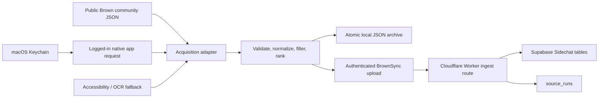

# BrownSync daily Sidechat top-10 collector

Status: fast implementation-ready draft

Date: 2026-07-29

Scope: collect one ranked snapshot of the top ten Brown Sidechat posts each day

## 1. Goal

Create an automated collector that produces one trustworthy, idempotent snapshot of the
top ten posts in Brown's Sidechat community every calendar day.

The first useful output is a local JSON file. BrownSync database storage and a read API
are included in the design so the same collector can later power a product surface
without changing how acquisition works.

This is a new data type. Sidechat posts are not events and must not be inserted into
BrownSync's `events` table or passed through event deduplication.

## 2. Assumptions for this draft

These defaults are intentionally easy to revise:

- Community: Brown's primary Sidechat campus/community feed.
- Ranking: Sidechat's own `Hot` or `Top` server order, treated as an opaque ranking.
- Window: the feed's daily period when available; otherwise an explicitly labeled
  point-in-time `Hot` snapshot.
- Capture time: first successful run at or after 9:00 PM America/New_York.
- Eligibility: ordinary posts only. Exclude ads, feed announcements, suggested-post
  carousels, deleted/removed posts, and pinned administrative posts.
- Output: up to ten distinct posts. Fewer than ten is a partial run and never replaces
  an existing complete snapshot.
- Comments are not collected.
- Media metadata and stable asset IDs are collected. Downloading image/video binaries is
  deferred.

“Top ten for a day” can mean two different things:

1. The first ten posts in Sidechat's ranked feed at the capture time.
2. The ten posts created during that New York calendar day with the highest visible
   vote totals.

This design uses definition 1 because it preserves Sidechat's ranking. Definition 2 can
be added later as a separate derived view; it should not silently replace the source's
ordering.

## 3. Evidence from the current environment

### Installed app

The installed app is:

- `/Applications/Sidechat.app/Wrapper/sidechat.app`
- bundle id `com.flowerave.sidechat`
- version `5.4.22`
- native arm64 iOS/UIKit application running on the Mac, not Electron
- declared API base `https://api.sidechat.lol`
- feed concepts present in the binary: `hot`, `recent`, `top`, cursors, and a daily
  `period` argument

Because it is native, there is no Electron DOM or Chrome DevTools session to reuse.
Authentication is likely app-sandbox/Keychain backed.

### Public web surface

Sidechat also has a SvelteKit web app at `https://web.sidechat.lol/`. A current
unauthenticated request to:

`https://web.sidechat.lol/api/home/posts?type=hot`

returns structured JSON with post ids, text, timestamps, vote totals, comment counts,
group metadata, assets, attachments, and a pagination cursor. Public community pages
use routes shaped like:

`https://web.sidechat.lol/cy/{community-index-name}`

The public home feed is mixed/global. A Brown-specific public JSON request has not yet
been verified, so implementation begins with a short discovery probe instead of
hard-coding a guessed community parameter.

### BrownSync

BrownSync's existing `services/poller` abstraction normalizes structured event feeds
into `SeedEvent[]` and always writes the `events` table. It is therefore the wrong
abstraction for Sidechat posts.

The Sidechat collector should be a standalone workspace package. It may reuse the
repository's HTTP, validation, testing, and `source_runs` conventions without reusing
the event-specific `SourceModule`.

## 4. Approaches considered

### A. Public structured JSON feed

Probe the Brown public community page, observe the JSON request it makes, and collect
the first ten eligible posts from that response.

Advantages:

- smallest and most reliable implementation
- structured ids, timestamps, counts, and media metadata
- can run unattended in GitHub Actions or any server
- no desktop UI, OCR, or private session handling

Limit:

- it is not yet proven that Brown's campus feed is publicly available

### B. Logged-in native app API replay

Observe one read-only Brown `Top` request made by the installed app, save the request
shape without credentials, store the session credential in macOS Keychain, and replay
that read request locally.

Advantages:

- structured data and stable post ids
- works for an authenticated Brown-only feed
- less fragile than UI coordinates or OCR after the request is known

Limits:

- one-time request discovery is required
- session credentials may expire
- certificate pinning or device-bound headers may prevent clean replay

### C. Native app accessibility with OCR fallback

Open Sidechat, select Brown and the `Top` feed, read the first ten accessible post cards,
and fall back to screenshots plus Apple Vision OCR when a card does not expose its text.

Advantages:

- reuses the already logged-in app without extracting its session
- remains available if authenticated request replay is impractical

Limits:

- app must run on Noah's logged-in Mac
- requires Accessibility permission and possibly Screen Recording permission
- UI labels, scrolling, and OCR are more fragile than JSON
- stable post ids may be unavailable, requiring content fingerprints

## 5. Decision

Use a tiered acquisition adapter:

1. **Primary:** Brown-specific public structured JSON.
2. **Fallback:** native app Accessibility capture, with OCR only for missing fields.
3. **Later optimization:** authenticated native API replay from a Keychain-held session
   if UI capture proves unreliable enough to justify the extra session-discovery work.

The collector selects the first configured adapter that passes its startup probe. The
normalized output is identical regardless of acquisition method, so changing adapters
does not affect storage, scheduling, or downstream consumers.

Time-box public-feed discovery to 15 minutes. If Brown's public JSON request cannot be
identified in that window, move directly to the installed-app adapter rather than
building a general Sidechat crawler.

## 6. Architecture



### Proposed repository layout

```text
services/sidechat-collector/
  package.json
  README.md
  src/
    cli.ts
    config.ts
    contract.ts
    collect.ts
    rank.ts
    archive.ts
    upload.ts
    acquisition/
      public-web.ts
      native-api.ts
      native-accessibility.ts
  fixtures/
    public-hot.synthetic.json
    accessibility.synthetic.json
  test/
    collect.test.ts
    rank.test.ts
    archive.test.ts

ops/launchagents/
  com.brownsync.sidechat.plist

db/migrations/
  0004_sidechat_snapshots.sql
```

If the public adapter works, add a dedicated GitHub workflow. If native authentication
or UI is required, scheduling stays on the Mac through `launchd`.

## 7. Acquisition contract

All adapters implement one interface:

```ts
type SidechatAcquisitionAdapter = {
  name: "public-web" | "native-api" | "native-accessibility";
  probe(): Promise<{ ready: boolean; reason?: string }>;
  fetchTop(input: {
    community: SidechatCommunity;
    preferredPeriod: "day";
    allowSnapshotFallback: true;
    minimumItems: 10;
  }): Promise<RawSidechatFeed>;
};
```

The adapter returns source order. It does not make ranking decisions and does not write
files or the database.

### Public adapter discovery

1. Open Brown's route from the public community directory.
2. Observe the structured feed request made by that page.
3. Record the actual URL, query names, cursor behavior, and response schema in a fixture.
4. Verify that the response's group id/name is Brown.
5. Do not invent a pagination parameter. Use only the cursor flow observed from the app.

### Authenticated app adapter discovery

1. In the installed app, navigate to Brown's `Top` feed with the daily period selected.
2. Observe exactly one read request and response.
3. Separate stable request configuration from session material.
4. Store session material in macOS Keychain under a dedicated BrownSync service name.
5. Never write authorization headers, cookies, device identifiers, or refresh tokens to
   the repository, fixtures, shell history, or logs.

If replay receives 401/403, stop the run, record an authentication error, and surface a
single “re-authentication required” notification. Do not fall into a retry loop.

### Accessibility adapter

1. Launch `sidechat://`.
2. Select Brown's community and the `Top` tab.
3. Wait for the feed to finish loading.
4. Read card labels from the macOS Accessibility tree.
5. Scroll only until ten eligible unique cards are collected or a bounded limit is hit.
6. OCR only the fields absent from Accessibility.
7. Generate a fallback id from a versioned SHA-256 fingerprint of normalized post text,
   creation label, and asset identifiers.

Do not use fixed screen coordinates as the primary selector. Prefer roles, labels, and
discoverable UI hierarchy.

## 8. Ranking and filtering

The source's order is canonical.

For each returned item:

1. Reject non-post feed decorations.
2. Reject deleted/removed items.
3. Reject ads and promoted items.
4. Reject pinned administrative posts by default.
5. Deduplicate by source post id, or by the fallback fingerprint.
6. Preserve the first occurrence.
7. Assign ranks 1 through 10.

If the source returns fewer than ten eligible posts after a bounded pagination attempt,
emit a `partial` run with the items found. Keep the partial artifact for diagnosis, but
do not publish it as that day's complete snapshot.

Visible vote count is stored as an observation, not used to override server order.

## 9. Normalized daily artifact

Canonical local path:

```text
var/sidechat/YYYY-MM-DD.json
```

`var/sidechat/` must be gitignored and created with user-only permissions. Write to a
temporary file, validate the complete document, then atomically rename it into place.
Write incomplete diagnostic output as `YYYY-MM-DD.partial.json`; it must never occupy the
canonical complete-snapshot path.

Example shape:

```json
{
  "schemaVersion": 1,
  "community": {
    "id": "source-community-id",
    "name": "Brown",
    "indexName": "observed-public-index-or-null"
  },
  "localDate": "2026-07-29",
  "timezone": "America/New_York",
  "capturedAt": "2026-07-30T01:05:00.000Z",
  "acquisitionMethod": "public-web",
  "ranking": {
    "type": "top",
    "period": "day",
    "sourceOrdered": true
  },
  "posts": [
    {
      "rank": 1,
      "postId": "source-post-id",
      "text": "post text",
      "createdAt": "2026-07-29T22:31:00.000Z",
      "voteTotal": 241,
      "commentCount": 18,
      "groupId": "source-community-id",
      "groupName": "Brown",
      "permalink": null,
      "pinned": false,
      "assetIds": [],
      "assetUrls": []
    }
  ],
  "collector": {
    "version": "1.0.0",
    "sourceAppVersion": null
  }
}
```

Also write `var/sidechat/latest.json` after a successful complete snapshot. CSV can be a
derived convenience output; JSON is the source of truth.

Signed media URLs may expire. Persist stable asset ids immediately. If media archival is
later required, add a separate bounded downloader during the same run.

## 10. BrownSync storage

Add an additive migration, not a change to the event contract.

### `sidechat_posts`

- `post_id text primary key`
- `community_id text not null`
- `body text`
- `created_at timestamptz`
- `permalink text`
- `asset_metadata jsonb not null default '[]'`
- `raw jsonb`
- `first_seen_at timestamptz not null default now()`
- `last_seen_at timestamptz not null default now()`

### `sidechat_snapshots`

- `id uuid primary key default gen_random_uuid()`
- `community_id text not null`
- `community_name text not null`
- `ranking_type text not null`
- `ranking_period text not null`
- `captured_on date not null`
- `captured_at timestamptz not null`
- `acquisition_method text not null`
- unique `(community_id, ranking_type, ranking_period, captured_on)`

### `sidechat_snapshot_items`

- `snapshot_id uuid references sidechat_snapshots(id)`
- `post_id text references sidechat_posts(post_id)`
- `rank smallint not null check (rank between 1 and 10)`
- `vote_total int`
- `comment_count int`
- primary key `(snapshot_id, post_id)`
- unique `(snapshot_id, rank)`

Publish a snapshot in one transaction:

1. Validate all ten normalized items.
2. Upsert post content and `last_seen_at`.
3. If a complete snapshot already exists for that community/date/ranking scope, return
   `already_exists` without changing it.
4. Otherwise insert the day's snapshot and its ten rank observations.
5. Record `source_runs.source = 'sidechat'` with `items_upserted = 10`.
6. Commit.

A partial run is not inserted into the snapshot tables and never replaces a complete
snapshot. Same-day retries are therefore idempotent and preserve the original capture.

## 11. Upload boundary

Do not put a full Supabase/Postgres credential on the collector machine.

Add:

```text
POST /api/internal/sidechat/snapshots
```

Requirements:

- `Authorization: Bearer <SIDECHAT_INGEST_TOKEN>`
- token stored as a Cloudflare Worker secret and in macOS Keychain
- constant-time credential comparison
- no browser CORS
- strict Zod request schema
- small request-body limit
- idempotency key `sidechat:{community-id}:{local-date}`
- one database transaction
- response contains only status, date, and item count

Add the public read route later:

```text
GET /api/sidechat/top?date=YYYY-MM-DD
```

Do not expose source `raw` payloads or private ingestion metadata through the public API.

## 12. Scheduling

### Public adapter

Use a dedicated GitHub Actions workflow that runs hourly. The collector itself checks
America/New_York time and exits successfully unless:

- local time is at or after 9:00 PM, and
- no complete snapshot exists for that local date.

Hourly triggering plus an in-process date gate avoids daylight-saving cron mistakes and
makes delayed GitHub runs harmless.

### Native app adapter

Install a per-user macOS LaunchAgent that runs every 30 minutes. Apply the same local-time
and idempotency gate. This is more reliable than one exact daily trigger because it
recovers after sleep, reboot, or a temporarily closed app.

The native collector should:

- require a logged-in user session
- never run more than one instance at a time
- cap the total run at two minutes
- retry transient load failures twice with short backoff
- preserve a diagnostic partial artifact on failure

## 13. Health behavior

Once Milestone 2 upload is configured, every attempted collection records one
`source_runs` entry:

- `ok`: exactly ten validated posts published
- `partial`: feed loaded, but fewer than ten eligible posts were available
- `error`: authentication, parsing, UI, upload, or database failure

Before Milestone 2, the local collector writes the equivalent status beside its
diagnostic artifact rather than requiring a database connection.

Do not immediately add `sidechat` to the web app's globally stale source list. The
current health model treats every source as stale after 45 minutes; a daily source would
make the global strip yellow for most of every day. First add per-source cadence, with
Sidechat stale only after approximately 30 hours.

## 14. Logging and notifications

Successful log:

```text
sidechat 2026-07-29 ok: 10 posts via public-web in 842 ms
```

Logs may include:

- date
- adapter name
- counts
- duration
- HTTP status class
- source post ids when debugging is explicitly enabled

Logs must never include:

- authorization headers or cookies
- Keychain values
- full post bodies
- private user/device identifiers

After the final retry fails, send one macOS notification or create one failed GitHub
workflow. Do not send repeated notifications during the same local date.

## 15. Tests

All CI tests use synthetic or redacted fixtures. CI never opens the installed app and
never accesses a live account.

Required tests:

- public response normalization
- accessibility response normalization
- exclusion of ads, announcements, pinned admin posts, and deleted posts
- stable preservation of server order
- deduplication before rank assignment
- America/New_York date boundary and daylight-saving behavior
- atomic local write
- exactly ten items publish successfully
- nine items produce `partial` and do not replace a complete snapshot
- same-date rerun is idempotent
- expired authentication fails without logging credentials
- database transaction rolls back fully on any invalid item
- upload rejects missing/wrong token and oversized/malformed payload

## 16. Implementation sequence

### Milestone 1: useful local file

1. Scaffold `services/sidechat-collector`.
2. Probe Brown's public community page and capture the real structured request.
3. Implement the public adapter if it works for Brown.
4. Otherwise implement the native Accessibility adapter.
5. Normalize, filter, rank, and atomically write dated JSON.
6. Run once manually and compare all ten results against the visible Sidechat feed.
7. Install the appropriate scheduler.

Milestone 1 is complete when the collector runs twice against the same day's feed and
leaves one valid canonical JSON artifact containing ten Brown posts.

### Milestone 2: BrownSync ingestion

1. Add contract schemas.
2. Add migration `0004_sidechat_snapshots.sql`.
3. Add the authenticated Worker ingest route.
4. Add Keychain-backed upload.
5. Add transaction/idempotency tests.
6. Deploy and verify the stored daily snapshot.

### Milestone 3: product surface

1. Add cadence-aware source health.
2. Add `GET /api/sidechat/top`.
3. Decide how, or whether, Sidechat appears in the web UI.

## 17. Acceptance criteria

- Exactly one complete Brown snapshot is published per New York calendar date.
- It contains ten unique ordinary posts in the same order as Sidechat's ranked feed.
- A complete snapshot is never overwritten by a partial or failed run.
- Re-running the collector on the same day creates no duplicate snapshot or ranks.
- The collector recovers after a missed exact trigger.
- No credentials are stored in Git, fixture files, logs, or the database.
- Local JSON is valid, atomic, and directly usable by another script or Claude.
- Sidechat posts remain separate from canonical events and event deduplication.
- The live workflow reports a clear `ok`, `partial`, or `error` result.

## 18. Claude implementation handoff

Start with Milestone 1 only. Time-box the Brown public-feed probe, then choose the first
working acquisition adapter. Do not build all three adapters in advance.

Preserve these decisions:

- source order defines rank
- one snapshot per community/day
- fail closed below ten posts
- atomic JSON output
- credentials only in Keychain/secrets
- no Sidechat rows in `events`
- no `KNOWN_SOURCES` health registration until cadence is configurable

Before implementing database or UI work, show one real local ten-post JSON snapshot and
verify its order against the installed app.
